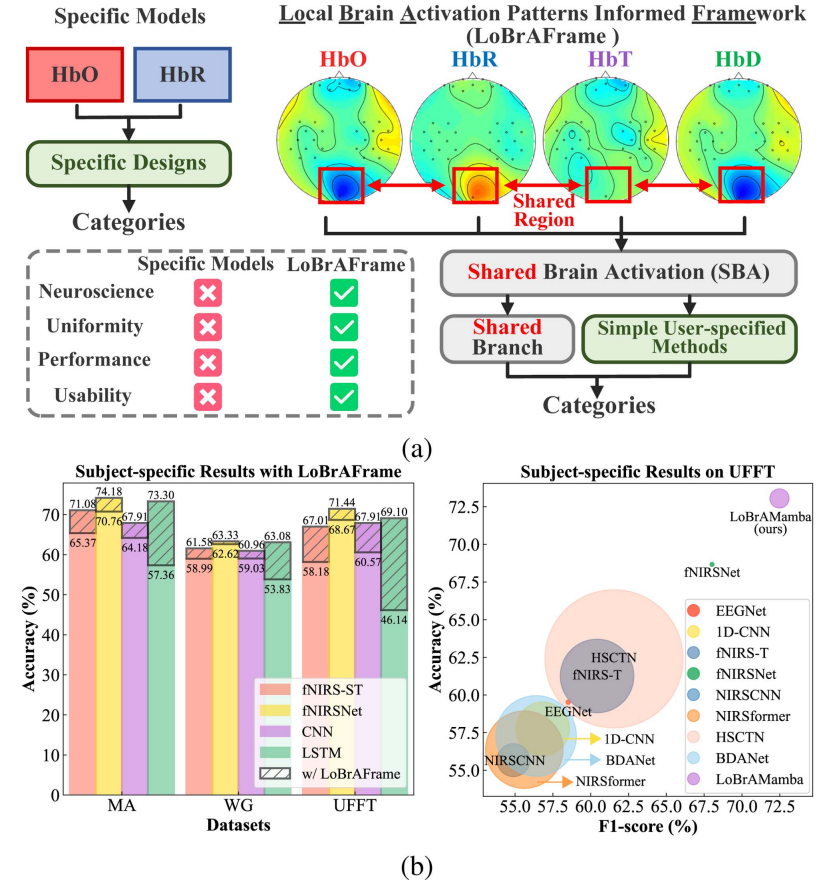
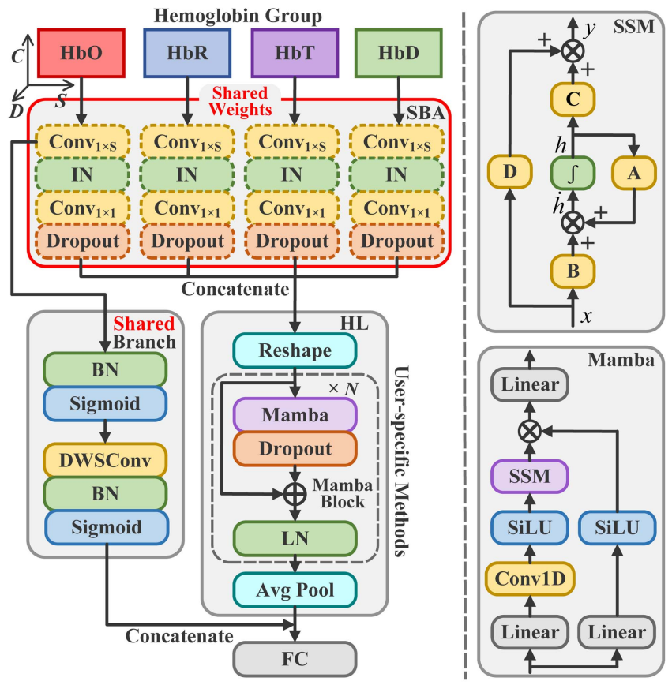

# LoBrAFrame

## A Unified fNIRS Classification Framework Informed by Local Brain Activation Patterns

Our paper titled *A Unified fNIRS Classification Framework Informed by Local Brain Activation Patterns* has been accepted by IEEE Transactions on Industrial Informatics ([https://ieeexplore.ieee.org/document/9670659](https://ieeexplore.ieee.org/document/11279989)). 


🌟 Our other work may also be useful to you：

✅ 🆕 🎯 ***Domain Knowledge Fused State Space Model for fNIRS-Based Brain–Computer Interfaces*** (https://ieeexplore.ieee.org/document/11522669, GitHub: https://github.com/wzhlearning/fNIRS4D). 

✅ ***Rethinking Delayed Hemodynamic Responses for fNIRS Classification*** (https://ieeexplore.ieee.org/document/10311392/, GitHub: https://github.com/wzhlearning/fNIRSNet).

✅ ***Transformer Model for Functional Near-Infrared Spectroscopy Classification*** (https://ieeexplore.ieee.org/document/9670659, GitHub: https://github.com/wzhlearning/fNIRS-Transformer).

✅ ***A General and Scalable Vision Framework for Functional Near-Infrared Spectroscopy Classification*** ( https://ieeexplore.ieee.org/abstract/document/9828508).


## Abstract
Recent studies have focused on task-specific and neuroscience-agnostic fNIRS classification models rather than a unified neuroscience-informed framework. We propose ***LoBrAFrame***, a unified, neuroscience-informed fNIRS classification framework that leverages local brain activation patterns through a shared weight mechanism. Within this framework, researchers can easily enhance classification performance using simple or off-the-shelf methods, without redesigning complex models. To instantiate a concrete model, we introduce Mamba, a state space model, into the fNIRS domain and propose ***LoBrAMamba***. Our work will inspire interest in neuroscience-informed fNIRS frameworks.

<div style="display: flex; justify-content: center; gap: 20px; flex-wrap: wrap;">
    
    
</div>


## Environment Setup
```bash
conda create -n lobraframe python=3.9
conda activate lobraframe
conda install pytorch==2.1.1 torchvision==0.16.1 torchaudio==2.1.1 pytorch-cuda=11.8 -c pytorch -c nvidia
conda install -c "nvidia/label/cuda-11.8.0" libcusolver-dev
```

You should install [mamba](https://github.com/state-spaces/mamba):
```bash
pip install causal-conv1d>=1.4.0
pip install mamba-ssm==2.2.1
```

No special requirements exist for other Python libraries needed for operation.


## Get Started
### 1. Datasets

| Dataset |  Link | GitHub  |
| :--- | :--- | :--- |
| **MA** | [http://doc.ml.tu-berlin.de/hBCI](http://doc.ml.tu-berlin.de/hBCI) | [https://github.com/JaeyoungShin/hybrid-BCI](https://github.com/JaeyoungShin/hybrid-BCI) |
| **WG** | [https://doc.ml.tu-berlin.de/simultaneous_EEG_NIRS/](https://doc.ml.tu-berlin.de/simultaneous_EEG_NIRS/) | [https://github.com/JaeyoungShin/simultaneous_EEG-NIRS](https://github.com/JaeyoungShin/simultaneous_EEG-NIRS) |
| **UFFT** | [https://doi.org/10.6084/m9.figshare.9783755.v1](https://doi.org/10.6084/m9.figshare.9783755.v1) | [https://github.com/JaeyoungShin/fNIRS-dataset](https://github.com/JaeyoungShin/fNIRS-dataset) |


### 2. Dataset Preprocessing
Use the .mat files provided in the ***scripts*** folder to preprocess the dataset. You need to download the BBCI library from the GitHub link. 


The ***scripts*** for MA and UFFT originate from our previous work (fNIRSNet: https://ieeexplore.ieee.org/document/10311392). The GitHub link is https://github.com/wzhlearning/fNIRSNet. 


### 3. Training
3.1 Manually specify dataset tasks (***task_id***) and paths (***UFFT_data_path***, ***MA_data_path***, ***WG_data_path***).

``` Python
# Select dataset through task_id
task = ['UFFT', 'MA', 'WG']
task_id = 0

# Set dataset path
UFFT_data_path = 'UFFT_data'
MA_data_path =  'MA_fNIRS_data'
WG_data_path =  'WG_fNIRS_data'
```


3.2 Run subject-specific experiments
```bash
python KFold_Train.py
```


3.3 Run subject-independent experiments
```bash
python LOSO_Train.py
```

### 4. Evaluation
4.1 Manually specify dataset tasks (***task_id***).

``` Python
# Select dataset through task_id
task = ['UFFT', 'MA', 'WG']
task_id = 0
```


4.2 Run subject-specific results
```bash
python KFold_Results.py
```


4.3 Run subject-independent results
```bash
python LOSO_Results.py
```


## Citation
If you found the study useful for you, please consider citing and star it.
```
@ARTICLE{Wang2025LoBrAFrame,
author  = {Wang, Zenghui and Du, Songlin},
journal = {IEEE Transactions on Industrial Informatics}, 
title   = {A Unified fNIRS Classification Framework Informed by Local Brain Activation Patterns}, 
year    = {2026},
volume  = {22},
number  = {3},
pages   = {1871-1881},
doi     = {10.1109/TII.2025.3632147}
}
```


🌟 Our other works may also be beneficial to you, please consider citing them. 


https://ieeexplore.ieee.org/document/11522669


https://github.com/wzhlearning/fNIRS4D

```
@ARTICLE{Wang2026fNIRS4D,
author  = {Wang, Zenghui and Zhu, Delv and Zhang, Jun and Xiao, Guobao and Du, Songlin},
journal = {IEEE Transactions on Instrumentation and Measurement}, 
title   = {Domain Knowledge Fused State Space Model for fNIRS-Based Brain–Computer Interfaces}, 
year    = {2026},
volume  = {75},
number  = {},
pages   = {4008016-4008016},
doi     = {10.1109/TIM.2026.3693454}}
```

https://ieeexplore.ieee.org/document/10311392


https://github.com/wzhlearning/fNIRSNet

```
@ARTICLE{wang2023fNIRSNet,
author  = {Wang, Zenghui and Fang, Jihong and Zhang, Jun},
journal = {IEEE Transactions on Neural Systems and Rehabilitation Engineering}, 
title   = {Rethinking Delayed Hemodynamic Responses for fNIRS Classification}, 
year    = {2023},
volume  = {31},
number  = {},
pages   = {4528-4538},
doi     = {10.1109/TNSRE.2023.3330911}}
```


https://ieeexplore.ieee.org/document/9670659


https://github.com/wzhlearning/fNIRS-Transformer

```
@ARTICLE{Wang2022Transformer,  
author  = {Wang, Zenghui and Zhang, Jun and Zhang, Xiaochu and Chen, Peng and Wang, Bing},  
journal = {IEEE Journal of Biomedical and Health Informatics},   
title   = {Transformer Model for Functional Near-Infrared Spectroscopy Classification},   
year    = {2022},  
volume  = {26},  
number  = {6},  
pages   = {2559-2569},  
doi     = {10.1109/JBHI.2022.3140531}}
```


https://ieeexplore.ieee.org/abstract/document/9828508
```
@ARTICLE{Wang2022VisionfNIRSFramework,
author  = {Wang, Zenghui and Zhang, Jun and Xia, Yi and Chen, Peng and Wang, Bing},
journal = {IEEE Transactions on Neural Systems and Rehabilitation Engineering}, 
title   = {A General and Scalable Vision Framework for Functional Near-Infrared Spectroscopy Classification}, 
year    = {2022},
volume  = {30},
number  = {},
pages   = {1982-1991},
doi     = {10.1109/TNSRE.2022.3190431}}
```

```
